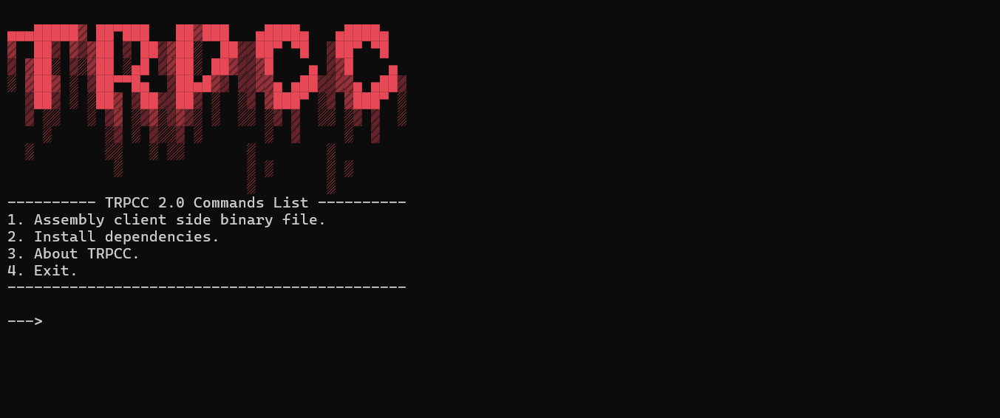

<h1 align="center">Telegram Remote PC Control (abbrev. TRPCC) 2.0</h1>

<b>TRPCC is a powerful software for remotely controlling your PC using a Telegram bot. It provides a wide range of functionalities, including system management, file operations, keylogging, hardware interaction, and more—all accessible through a Telegram chat interface.  TRPCC provides file management, like uploading, downloading files from the client PC, renaming files, deleting files, etc., generic system controlling like executing system commands with output fetching support, managing the processes (view PIDs, kill processes), lock PC, shutdown, etc., hardware interaction like controlling keyboard and mouse, enabling or disabling monitors, etc., clipboard access, advanced keylogging, controlling sounds, volume control, injecting Python scripts, password protection for secure usage, and much much more.</b>

<h2 align="center">Installation & usage</h2>

<b>Install <a href="https://www.python.org/downloads/release/python-399/"><code>Python 3.9</code></a> (Make sure to add it to your system's PATH during installation.), create a bot via <a href="https://telegram.me/BotFather">@BotFather</a>, copy bot token, and follow these steps. 
   1. Clone or download the repository: <code>git clone https://github.com/xzripper/trpcc.git</code> or click <a href="https://github.com/xzripper/trpcc/archive/refs/heads/main.zip">here</a> (you have to unzip an archive if you proceed with the click). Congratulations! TRPCC is now installed successfully!  </b>TRPCC Console.<b>  Future usage is effortless and straightforward. Before assembling client you must choose second option for installing dependencies or checking for any missing, after you can freely assemble client-side binary file by choosing first option. You write down an application name, icon, token, and bot password. You also can edit <code>META.dat</code> for modifying binary metadata by following instructions in meta file. After assembling the client-side binary file, run the generated binary file on the client PC. Interact with the bot via the Telegram app by sending commands.</b>

<h2 align="center">Notes</h2>

<b>1. Password protection can be enabled during client setup. 2. The bot only supports one client per compiled binary, ensuring targeted control. 3. Windows 7+ is currently primary platform for TRPCC. Linux and macOS support is experimental and may not include all features. 4. After using the next commands some machines may halt all processes and TRPCC also, so bot is not going to receive commands: <code>/enablemonitor</code>, <code>/disablemonitor</code>, <code>/lockpc</code>. 5. If client-side PC is not active, i.e asleep or disabled, you can send <code>/alive</code> to get notification after TRPCC process is restored. 6. When building client-side binary you have to specify only <code>.ICO</code> icon (if you have any icons, its optional). 7. Type <code>/help</code> to get list of all commands. 8. Report any bugs or issues <a href="https://github.com/xzripper/trpcc/issues">here</a>!</b>

<b>TRPCC 2.0 by <a href="https://github.com/xzripper">xzripper</a> (2024-2025).</b>

